# Azure Enterprise Infrastructure

## Project Overview

This project demonstrates the design and implementation of a secure and supportable Microsoft Azure infrastructure environment for a fictional organization.

The project is being developed as a hands-on cloud engineering environment to demonstrate practical implementation across cloud infrastructure, networking, identity, security, monitoring, automation and Infrastructure as Code.

## Business Scenario

A growing organization requires a secure, scalable and supportable Azure environment for hosting business workloads while maintaining controlled access, operational visibility, data protection and repeatable infrastructure delivery.

The infrastructure must provide:

- Segmented cloud networking
- Secure access to workloads
- Identity and role-based access control
- Windows and Linux compute resources
- Cloud storage
- Infrastructure monitoring and alerting
- Backup and recovery
- Repeatable infrastructure deployment

## Technologies

This project will progressively use:

- Microsoft Azure
- Microsoft Entra ID
- Azure Virtual Network
- Network Security Groups
- Azure Virtual Machines
- Azure Bastion
- Azure NAT Gateway
- Azure Network Watcher
- Azure Storage
- Azure Monitor

## Project Status

🟡 In Progress

### Completed

- Created a dedicated Azure subscription for the lab environment
- Configured a monthly Azure cost budget with 50%, 75% and 90% actual-cost alerts
- Selected UK South as the primary deployment region
- Established an enterprise-style resource naming convention
- Created the development resource group `rg-azure-enterprise-dev`
- Implemented resource tagging for environment, project, purpose and management method
- Designed and deployed `vnet-enterprise-dev` using a `10.10.0.0/16` private address space
- Segmented the virtual network into dedicated web, application and management `/24` subnets
- Created dedicated Network Security Groups for the web, application and management tiers
- Associated `nsg-web-dev` with `snet-web`, `nsg-app-dev` with `snet-app`, and `nsg-management-dev` with `snet-management`
- Configured a custom inbound HTTPS rule on the web tier to allow TCP/443 traffic while retaining Azure's default deny behavior for unmatched inbound traffic
- Created a Standard LRS Azure Storage Account in UK South for enterprise application data
- Restricted storage network access to approved networks using the `Microsoft.Storage` service endpoint on `snet-app`
- Configured temporary client-IP access for controlled administrative testing without exposing the storage account to all public networks
- Implemented Microsoft Entra ID authorization and assigned `Storage Blob Data Contributor` RBAC permissions for authenticated data-plane access
- Disabled anonymous Blob access and enforced secure transfer with TLS 1.2
- Implemented 7-day soft-delete protection for blobs and containers and enabled Blob Versioning
- Validated Blob Versioning by overwriting a test configuration object and successfully accessing the retained previous version
- Validated Soft Delete by deliberately deleting and successfully recovering a protected Blob object
- Created Microsoft Entra ID security groups to implement group-based access management rather than relying on direct user-level role assignments
- Assigned `Storage Blob Data Contributor` to `grp-storage-users` at storage-account scope, providing controlled Blob data-plane access through group membership
- Removed the redundant direct user-level Blob role assignment and validated that storage access continued through Entra security-group membership
- Created `grp-cloud-operations` and assigned the built-in `Contributor` role at `rg-azure-enterprise-dev` scope for infrastructure-management access without role-assignment privileges
- Created `grp-cloud-readers` and assigned the built-in `Reader` role at resource-group scope to provide read-only infrastructure visibility
- Validated group-based RBAC behaviour and resolved an authorization issue caused by missing group membership and stale authentication-session information
- Created the `law-azure-enterprise-dev` Log Analytics workspace in UK South using the Pay-as-you-go pricing tier
- Configured Log Analytics data retention and enabled a 0.1 GB/day ingestion cap to control monitoring costs
- Configured Azure Storage diagnostic settings using `diag-blob-to-law` to send Blob Read, Write and Delete logs to Log Analytics
- Validated Azure Blob Storage telemetry ingestion through the `StorageBlobLogs` table
- Used KQL to investigate Blob read, write and delete activity, authentication methods, HTTP status codes and failed operations
- Created a reusable `Enterprise Blob Operations Audit` KQL query for investigating Blob activity
- Created an Azure Monitor log-search alert `alert-blob-failures-dev` to detect failed Blob operations
- Configured the alert to evaluate failed Blob operations using a 30-minute aggregation and evaluation period with a threshold of greater than zero matching events
- Created the `ag-azure-enterprise-dev` Action Group with email notification delivery
- Successfully validated the complete Azure Monitor alerting pipeline by generating Blob failures, confirming the events in Log Analytics, triggering the Azure Monitor alert and receiving the email notification
- Tuned the alert query to focus on core Blob operations and significant authentication/service failures while reducing known portal/system noise
- Created the `bv-azure-enterprise-dev` Azure Backup Vault in UK South using locally redundant backup storage
- Enabled 14-day soft delete protection on the Backup Vault and configured a system-assigned managed identity
- Created the `bp-blob-enterprise-dev` Azure Blob backup policy with 30-day operational backup retention
- Configured daily vaulted Blob backups with 30-day retention to provide an isolated recovery copy outside the source storage account
- Protected the `enterprise-data` container in `stazureenterprisedev` using Azure Backup
- Assigned the required Azure RBAC permissions to the Backup Vault managed identity and successfully validated backup readiness
- Successfully completed an on-demand vaulted backup and confirmed creation of a `Vault-standard` recovery point
- Created `stazurerecoverydev` as a dedicated alternate recovery storage account in UK South
- Successfully restored the protected `enterprise-data` container from the vaulted recovery point to `enterprise-data-restored` in the alternate storage account
- Resolved restore-validation and post-recovery data-access issues using managed-identity permissions and `Storage Blob Data Contributor` data-plane RBAC
- Verified the recovered `enterprise-config.txt` Blob in the alternate recovery storage account, completing an end-to-end backup and recovery test
- Deployed `vm-app-linux-dev-01` as a private Ubuntu Server 24.04 LTS application-tier virtual machine in `snet-app`
- Configured Trusted Launch, Secure Boot, vTPM, SSH public-key authentication and a system-assigned managed identity
- Maintained a private VM architecture with no VM-level public IP address
- Implemented secure administrative access to the private Linux VM using Azure Bastion
- Used Azure Network Watcher Next Hop and IP Flow Verify to troubleshoot outbound connectivity and validate routing and NSG behaviour
- Implemented `nat-app-dev` with static public IP `pip-nat-app-dev` to provide controlled outbound Internet connectivity for `snet-app`
- Validated outbound HTTPS connectivity through the NAT Gateway with a successful HTTP/2 200 response
- Validated Ubuntu repository connectivity and successful package-index retrieval from the private VM

### Current Phase

Compute deployment and private-network connectivity validation are complete.

The environment now includes validated networking, Microsoft Entra ID and Azure RBAC, secure Blob Storage, Azure Monitor and Log Analytics, alerting, Azure Backup and recovery, and a private Linux compute workload with secure Bastion administration and NAT Gateway outbound connectivity.

The next phase will expand infrastructure testing and operational validation before progressing to Terraform Infrastructure as Code.

## Resource Organisation

The project uses the following Azure resource organisation:

| Resource | Name | Purpose |
|---|---|---|
| Subscription | Azure subscription 1 | Billing and resource management boundary |
| Resource Group | rg-azure-enterprise-dev | Logical container for development infrastructure |
| Primary Region | UK South | Primary deployment region |

### Resource Tags

| Tag | Value |
|---|---|
| Environment | Development |
| Project | AzureEnterpriseLab |
| Purpose | CloudEngineeringPortfolio |
| ManagedBy | Manual |

The environment is currently being deployed manually through the Azure Portal to develop practical understanding of each Azure component before recreating the infrastructure using Terraform.

## Network Architecture

The Azure environment uses a segmented virtual network to separate
workloads based on their function and security requirements.

### Network Security Design

| Network Security Group | Associated Subnet | Security Purpose |
| ---------------------- | ----------------- | ---------------- |
| nsg-web-dev | snet-web | Controls inbound and outbound traffic for web-tier workloads |
| nsg-app-dev | snet-app | Protects application-tier workloads from unnecessary direct access |
| nsg-management-dev | snet-management | Provides a dedicated security boundary for administrative workloads |

The web-tier NSG currently permits inbound HTTPS traffic over TCP port 443 using a custom priority 100 rule.

Application and management tiers are not directly exposed through custom Internet-facing inbound rules. Additional access will be introduced only where required by the workload architecture, following least-privilege principles.

### Virtual Network

| Component | Configuration |
|---|---|
| VNet | vnet-enterprise-dev |
| Address Space | 10.10.0.0/16 |
| Region | UK South |
| Resource Group | rg-azure-enterprise-dev |

### Subnet Design

| Subnet | Address Range | Purpose |
|---|---|---|
| snet-web | 10.10.1.0/24 | Web-facing workloads |
| snet-app | 10.10.2.0/24 | Application workloads |
| snet-management | 10.10.3.0/24 | Administrative and management workloads |

The /16 VNet provides sufficient address capacity for future expansion,
while dedicated /24 subnets provide logical workload segmentation.

The segmented network is protected using dedicated Network Security Groups (NSGs) for the web, application and management tiers. Custom traffic rules are introduced only where required by the workload architecture, following least-privilege principles.

## Storage Architecture

The environment includes an Azure Storage Account for secure application and business data storage.

### Storage Configuration

| Component | Configuration |
| --- | --- |
| Storage Account | stazureenterprisedev |
| Primary Service | Azure Blob Storage |
| Region | UK South |
| Performance | Standard |
| Redundancy | Locally Redundant Storage (LRS) |
| Access Tier | Hot |
| Blob Container | enterprise-data |
| Anonymous Access | Disabled |
| Minimum TLS | TLS 1.2 |
| Encryption | Microsoft-managed keys |

### Network Security

Storage network access is restricted to selected networks rather than being exposed to all public networks.

The `snet-app` subnet is authorised through a `Microsoft.Storage` service endpoint, allowing application-tier workloads to access the storage service through the approved Azure network path.

Temporary client-IP access was introduced for controlled administrative testing without changing the storage account to unrestricted public network access.

### Identity and Access Control

Microsoft Entra ID is configured as the default authorization method for Azure Storage data access through the Azure portal.

The `Storage Blob Data Contributor` Azure RBAC role was assigned to provide authenticated data-plane permissions for Blob operations without relying on storage account keys for routine access.

This demonstrated the distinction between:

- Azure management-plane permissions
- Storage data-plane permissions
- Network-level access controls

### Data Protection

The following data-protection controls were implemented:

- Blob soft delete with a 7-day retention period
- Container soft delete with a 7-day retention period
- Blob Versioning
- Encryption at rest using Microsoft-managed keys
- Secure transfer for data in transit

### Validation Testing

Blob Versioning was validated by uploading an initial configuration object, modifying the object, and uploading the updated version under the same name. Azure retained the previous version and allowed it to be accessed through version history.

Soft Delete was validated by deliberately deleting the test Blob and successfully recovering it during the configured retention period.

These tests confirmed that the configured controls provide protection against both accidental modification and accidental deletion.

## Identity and RBAC Architecture

Microsoft Entra ID security groups and Azure Role-Based Access Control (RBAC) are used to provide role-based access to infrastructure and data resources.

The access model follows least-privilege principles by assigning permissions to security groups at the minimum practical Azure scope rather than relying on broad direct user assignments.

### Security Group Design

| Security Group | Azure Role | Scope | Purpose |
| --- | --- | --- | --- |
| grp-storage-users | Storage Blob Data Contributor | stazureenterprisedev | Authenticated Blob data operations |
| grp-cloud-readers | Reader | rg-azure-enterprise-dev | Read-only infrastructure visibility |
| grp-cloud-operations | Contributor | rg-azure-enterprise-dev | Infrastructure resource management |

### RBAC Design

Azure RBAC assignments in the environment are based on three components:

- **Security principal** — the Microsoft Entra ID user or group receiving access
- **Role definition** — the set of permitted actions
- **Scope** — the Azure boundary where those permissions apply

Group-based assignments are preferred over direct user-level assignments to simplify access administration and provide a more scalable joiner, mover and leaver model.

### Storage Data Access

Blob data access is provided through membership of `grp-storage-users`.

The group is assigned the `Storage Blob Data Contributor` role at the `stazureenterprisedev` storage-account scope, allowing authorised members to perform Blob data operations without requiring individual role assignments.

A previously assigned direct user-level Blob role was removed and access was successfully validated through group membership alone.

### Infrastructure Operations

`grp-cloud-operations` is assigned the built-in `Contributor` role at `rg-azure-enterprise-dev` scope.

This allows the group to manage resources within the development environment while separating infrastructure-management capability from Azure RBAC role-assignment authority.

### Read-Only Access

`grp-cloud-readers` is assigned the built-in `Reader` role at `rg-azure-enterprise-dev` scope.

This provides visibility into infrastructure configuration without granting permission to modify resources.

### RBAC Validation and Troubleshooting

Group-based Blob access was tested by removing the direct `Storage Blob Data Contributor` assignment from the test user.

Initial access failed because the user was configured as a group owner but had not been added as a group member. After correcting group membership, the existing Azure authentication session still returned an authorization error.

A complete sign-out and reauthentication refreshed the Microsoft Entra authentication context, after which Blob access succeeded through `grp-storage-users`.

This validation demonstrated:

- The distinction between group ownership and group membership
- Group-based inheritance of Azure RBAC permissions
- The difference between management-plane and data-plane authorization
- The importance of RBAC scope
- Authentication-session and token refresh considerations following identity changes
- The operational benefits of group-based access management

## Monitoring and Logging

Azure Monitor and Log Analytics provide operational visibility into the Azure environment.

### Log Analytics Workspace

| Component | Configuration |
|---|---|
| Workspace | law-azure-enterprise-dev |
| Region | UK South |
| Pricing Tier | Pay-as-you-go |
| Retention | 31 days |
| Daily ingestion cap | 0.1 GB/day |

### Storage Diagnostic Logging

A diagnostic setting named `diag-blob-to-law` was configured on the storage account to send the following Blob Storage categories to Log Analytics:

- Storage Read
- Storage Write
- Storage Delete

Logs are collected in the `StorageBlobLogs` table.

### KQL Investigation

KQL was used to investigate:

- Blob read, write and delete operations
- Microsoft Entra OAuth authentication
- HTTP status codes and failed operations
- Blob-specific activity using URI filtering
- Operational activity associated with `enterprise-config.txt`

A reusable query named `Enterprise Blob Operations Audit` was created to provide a focused view of Blob read, write and delete activity.

### Alerting

An Azure Monitor log-search alert named `alert-blob-failures-dev` was configured to identify significant Blob operation failures.

The alert currently evaluates:

- `GetBlob`
- `PutBlob`
- `DeleteBlob`
- `ListBlobs`

The alert focuses on HTTP 401, 403 and 500+ responses while excluding known `$blobchangefeed` noise.

### Notification

An Action Group named `ag-azure-enterprise-dev` was created with email notification delivery.

The alert was successfully validated through an end-to-end test:

1. Generated Blob Storage activity
2. Confirmed telemetry in `StorageBlobLogs`
3. Generated qualifying Blob failures
4. Confirmed the Azure Monitor alert fired
5. Confirmed the email notification was received

The alert was subsequently tuned to reduce false positives while retaining meaningful failure detection.

### Cost Control

Monitoring was configured with a 30-minute aggregation and evaluation interval. Azure estimated the configured log-search alert at approximately $0.50 per month. Actual monitoring costs may vary based on data ingestion and other Azure Monitor usage.

## Backup and Recovery

Azure Backup was implemented to provide both operational recovery and an isolated vaulted recovery capability for business data stored in Azure Blob Storage.

### Backup Architecture

| Component | Configuration |
|---|---|
| Backup Vault | bv-azure-enterprise-dev |
| Region | UK South |
| Backup Storage Redundancy | Locally Redundant Storage (LRS) |
| Vault Soft Delete | 14 days |
| Managed Identity | System-assigned |
| Backup Policy | bp-blob-enterprise-dev |
| Protected Storage Account | stazureenterprisedev |
| Protected Container | enterprise-data |
| Operational Backup Retention | 30 days |
| Vaulted Backup Frequency | Daily |
| Vaulted Backup Retention | 30 days |

### Protection Design

The backup architecture uses two complementary recovery mechanisms.

**Operational backup** provides continuous protection with a 30-day recovery window for rapid point-in-time recovery.

**Vaulted backup** creates a separate recovery copy in `bv-azure-enterprise-dev`, providing recovery capability outside the source storage account. Vaulted backups are scheduled daily and retained for 30 days.

The Backup Vault uses a system-assigned managed identity. Required Azure RBAC permissions were assigned to this identity during backup-readiness validation rather than using stored credentials.

### Backup Validation

An on-demand vaulted backup was triggered after protection was configured.

The backup job completed successfully and created a full `Vault-standard` recovery point for the protected Blob container.

This confirmed that:

- The storage account was successfully registered for protection
- Backup Vault managed-identity permissions were correctly configured
- The Blob backup policy was operational
- A recoverable vaulted copy of the protected data existed

### Recovery Test

A controlled restore test was performed using the vaulted recovery point.

Azure Blob vaulted restore requires block blobs to be restored to an alternate storage account. A dedicated recovery account named `stazurerecoverydev` was therefore deployed in UK South using Standard LRS storage.

The `enterprise-data` container was restored to:

`stazurerecoverydev / enterprise-data-restored`

The restored container was deliberately given a different name to distinguish recovered data from the original source.

### Recovery Security

The Backup Vault system-assigned managed identity was granted the permissions required to write restored data to the recovery storage account.

After the restore, interactive access initially returned an HTTP 403 authorization error because management-plane access to the storage account did not automatically provide Blob data-plane access.

`Storage Blob Data Contributor` was assigned for authenticated Blob access, after which the restored data became accessible.

This demonstrated the separation between:

- Azure resource management permissions
- Blob data-plane RBAC permissions
- Storage network controls
- Azure Backup managed-identity permissions

### Recovery Validation

The restored `enterprise-data-restored` container was successfully accessed in the alternate recovery storage account.

The recovered `enterprise-config.txt` block Blob was verified successfully, completing the end-to-end recovery test.

The validated recovery path was:

`stazureenterprisedev` → `enterprise-data` → Azure Backup → `bv-azure-enterprise-dev` → vaulted recovery point → `stazurerecoverydev` → `enterprise-data-restored` → `enterprise-config.txt`

This test demonstrated that the environment can recover protected business data from an isolated vaulted backup without overwriting the original source data.

## Planned Project Phases

1. ✅ Architecture and requirements
2. ✅ Azure subscription and cost controls
3. ✅ Resource organization
4. ✅ Virtual network and subnet design
5. ✅ Network security
6. ✅ Compute deployment
7. ✅ Identity and RBAC
8. ✅ Storage
9. ✅ Monitoring and logging
10. ✅ Backup and recovery
11. ⬜ Infrastructure testing
12. ⬜ Terraform Infrastructure as Code
13. ⬜ Final architecture documentation

## Learning Objectives

Through this project I aim to develop and demonstrate practical capability in:

- Designing Azure infrastructure
- Implementing secure cloud networking
- Applying least-privilege access principles
- Deploying and managing cloud compute resources
- Monitoring infrastructure health and performance
- Planning backup and recovery
- Automating infrastructure deployment
- Using Terraform for Infrastructure as Code
- Documenting technical architecture and engineering decisions


## Compute Infrastructure & Secure Private VM Deployment

### Linux Virtual Machine Deployment

The compute phase of the project introduced a private Linux virtual machine into the existing enterprise network architecture. The VM was designed to operate as an application-tier workload while maintaining a private network posture and avoiding direct exposure to the public Internet.

#### VM Configuration

| Configuration | Value |
|---|---|
| Virtual Machine | `vm-app-linux-dev-01` |
| Operating System | Ubuntu Server 24.04 LTS |
| Region | UK South |
| VM Size | `Standard_B2ls_v2` |
| vCPUs | 2 |
| Memory | 4 GiB |
| Architecture | x64 |
| Authentication | SSH Public Key |
| Private IP | `10.10.2.4` |
| Public IP | None |
| Virtual Network | `vnet-enterprise-dev` |
| Subnet | `snet-app (10.10.2.0/24)` |
| OS Disk | Standard SSD |
| Security Type | Trusted Launch |

#### Security & Management Configuration

The Linux virtual machine was configured with additional security, identity, maintenance, and cost-management controls:

- **Trusted Launch:** Enabled
- **Secure Boot:** Enabled
- **vTPM:** Enabled
- **Standard SSD managed OS disk:** Enabled
- **Auto-shutdown:** Enabled
- **Periodic OS assessment:** Enabled
- **System-assigned Managed Identity:** Enabled
- **Direct public IP assignment:** Disabled

The VM was intentionally deployed without a public IP address to reduce its Internet-facing attack surface.

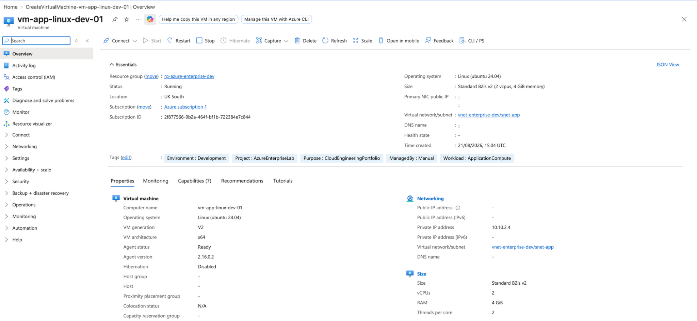

---

### Private Network Integration

The Linux VM was integrated into the existing application subnet:

- **Virtual Network:** `vnet-enterprise-dev`
- **Application Subnet:** `snet-app`
- **Address Range:** `10.10.2.0/24`
- **VM Private IP:** `10.10.2.4`
- **Network Security Group:** `nsg-app-dev`
- **VM Public IP:** None

This design keeps the application workload private while network security is enforced through the NSG associated with the application subnet.

The resulting network placement is:

```text
vnet-enterprise-dev
        |
        +-- snet-web        10.10.1.0/24
        |
        +-- snet-app        10.10.2.0/24
        |       |
        |       +-- vm-app-linux-dev-01
        |             Private IP: 10.10.2.4
        |             Public IP: None
        |
        +-- snet-management 10.10.3.0/24
```

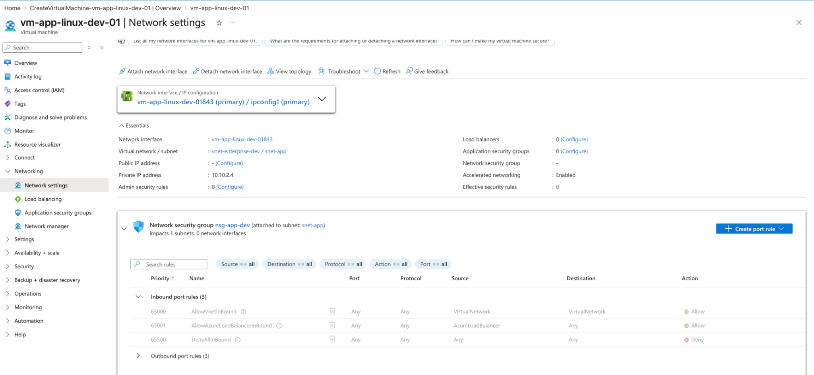

---

### Managed Identity

A system-assigned managed identity was enabled for `vm-app-linux-dev-01`.

This registers the virtual machine with Microsoft Entra ID and provides the VM with its own identity that can be used to authenticate to supported Azure services without storing usernames, passwords, access keys or other credentials directly on the virtual machine.

The managed identity is tied to the lifecycle of the VM and can be granted Azure RBAC permissions when access to other Azure resources is required.

This configuration establishes the foundation for identity-based service-to-service authentication and supports the project's broader least-privilege security model.

---

### Secure Administrative Access with Azure Bastion

Because the Linux virtual machine was intentionally deployed without a public IP address, direct SSH access from the public Internet was not enabled.

Azure Bastion was used to establish secure administrative access to the private VM through the Azure portal.

The connection used:

- **Virtual Machine:** `vm-app-linux-dev-01`
- **Username:** `azureuser`
- **Authentication:** SSH private key
- **VM Public IP:** None
- **VM Private IP:** `10.10.2.4`
- **Access Method:** Azure Bastion

This allowed an authenticated SSH session to be established without exposing TCP port 22 directly to the public Internet.

Successful access to the Ubuntu 24.04 LTS shell confirmed that the VM was operational and administratively accessible through the private network architecture.

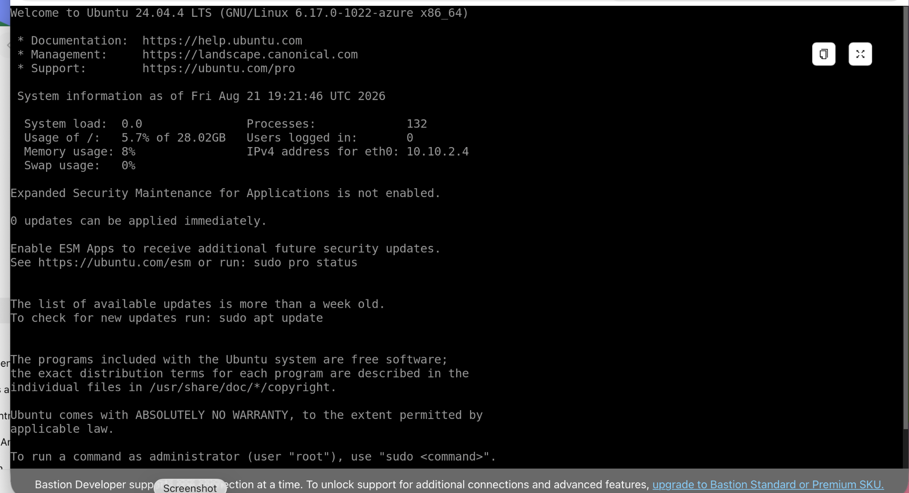

---

### Outbound Connectivity Troubleshooting

After deployment, the private Linux VM was accessible through Azure Bastion but outbound HTTPS connectivity from the VM was unsuccessful.

Initial testing showed that DNS resolution was functioning and the VM had a valid default route. However, HTTPS requests to external Internet services timed out.

Azure Network Watcher was used to investigate the network path.

#### Next Hop Validation

A Next Hop test was performed from the VM's network interface using `8.8.8.8` as the destination.

The result returned:

- **Next hop type:** Internet
- **Route:** System Route

This confirmed that Azure routing recognised the Internet as the appropriate next hop for outbound traffic.

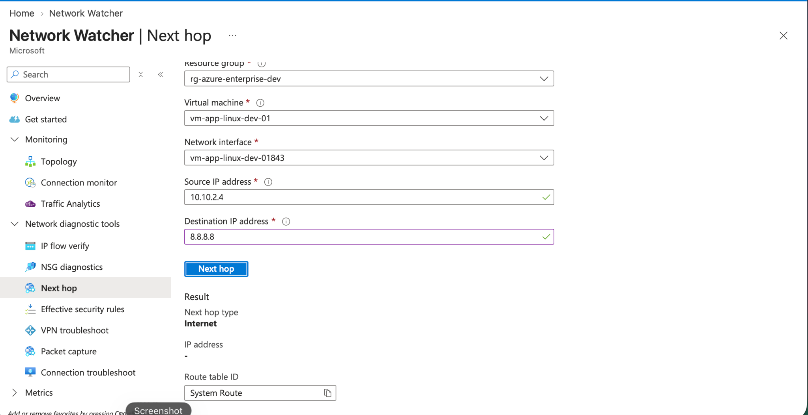

#### NSG Outbound Validation

IP Flow Verify was then used to determine whether the Network Security Group was blocking outbound HTTPS traffic.

The test confirmed:

- **Direction:** Outbound
- **Protocol:** TCP
- **Destination Port:** 443
- **Result:** Access allowed
- **Security Rule:** `AllowInternetOutBound`

This demonstrated that `nsg-app-dev` was not responsible for the connectivity failure.

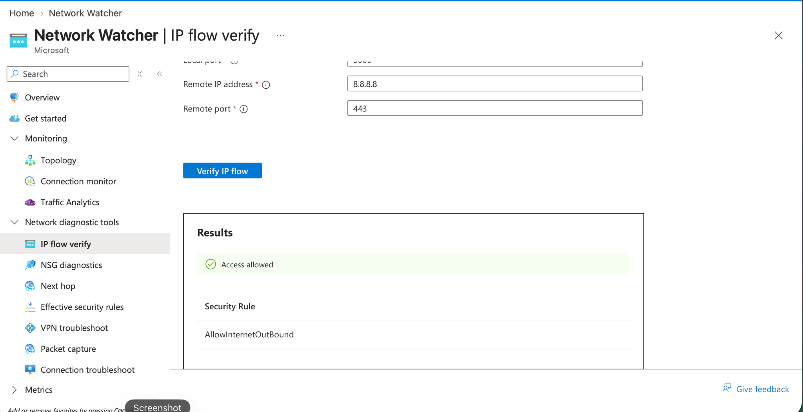

The combined troubleshooting results demonstrated that both Azure routing and NSG policy permitted outbound connectivity. The remaining issue was therefore associated with providing explicit outbound Internet connectivity for the private application subnet.

---

### NAT Gateway Implementation

An Azure NAT Gateway was implemented to provide controlled outbound Internet connectivity for workloads hosted in the private `snet-app` subnet.

The NAT Gateway was configured as follows:

| Configuration | Value |
|---|---|
| NAT Gateway | `nat-app-dev` |
| Region | UK South |
| SKU | Standard |
| Public IP | `pip-nat-app-dev` |
| Public IP Assignment | Static |
| Virtual Network | `vnet-enterprise-dev` |
| Associated Subnet | `snet-app (10.10.2.0/24)` |
| TCP Idle Timeout | 4 minutes |

The NAT Gateway was associated at subnet level rather than assigning a public IP directly to the VM.

This preserves the VM's private network posture while providing explicit outbound Internet connectivity through a controlled Azure networking resource.

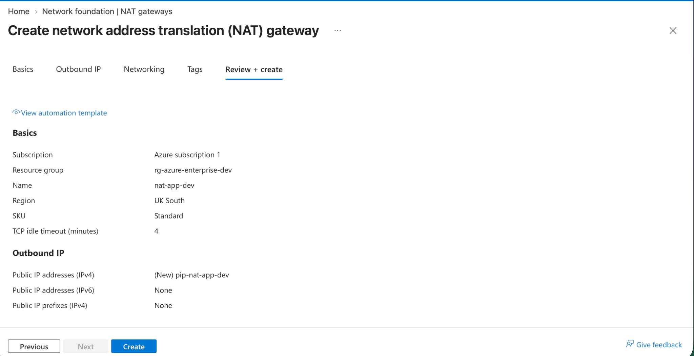

---

### Outbound Connectivity Validation

After associating the NAT Gateway with `snet-app`, outbound connectivity tests were repeated from `vm-app-linux-dev-01`.

#### HTTPS Validation

An HTTPS request to an external Internet endpoint completed successfully and returned:

`HTTP/2 200`

This confirmed successful outbound TCP/443 connectivity from the private VM through the NAT Gateway.

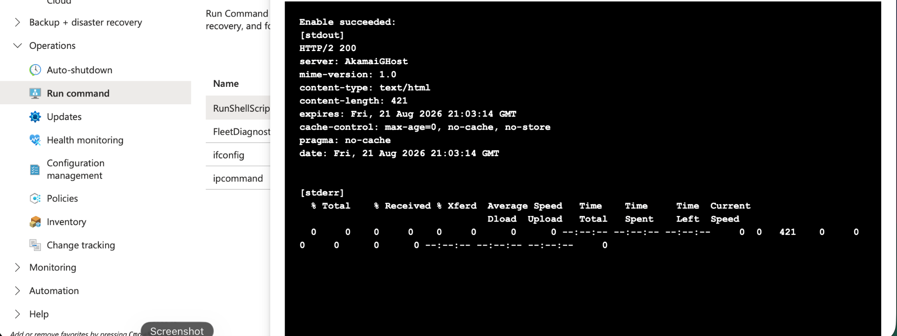

#### Ubuntu Repository Validation

Package repository connectivity was also tested using Ubuntu's package management service.

The VM successfully contacted `azure.archive.ubuntu.com`, downloaded repository metadata and refreshed the package index.

The validation downloaded approximately **36.7 MB** of repository information and identified available package upgrades.

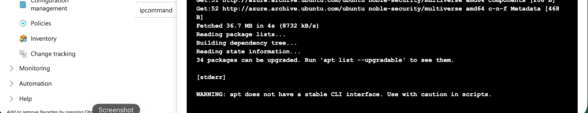

The completed connectivity path is therefore:

`vm-app-linux-dev-01` → `snet-app` → `nat-app-dev` → `pip-nat-app-dev` → Internet

This implementation demonstrates a secure cloud networking pattern in which a workload can remain privately addressed while retaining controlled outbound access required for operating-system updates, package retrieval and external service communication.

---

### Compute Phase Validation

The compute implementation successfully demonstrated:

- Deployment of an Ubuntu Linux workload in Azure
- Integration with an existing segmented virtual network
- Private addressing without a VM-level public IP
- Subnet-level Network Security Group protection
- Trusted Launch, Secure Boot and vTPM
- SSH public-key authentication
- System-assigned managed identity
- Secure administrative access using Azure Bastion
- Azure Network Watcher troubleshooting
- Next Hop route validation
- NSG IP Flow verification
- NAT Gateway implementation
- Controlled outbound Internet connectivity
- Successful HTTPS connectivity
- Successful Ubuntu repository access
- Automated VM shutdown for cost management


---

## Azure VM Monitoring and Operational Visibility

Monitoring was configured and validated for `vm-app-linux-dev-01` to provide operational visibility into workload health, availability and resource utilization.

Azure Monitor was used to validate the operational state of the VM and collect platform and guest-level telemetry.

### Monitoring Validation

The monitoring implementation demonstrated:

- VM availability and health monitoring
- Azure platform metrics collection
- CPU utilization monitoring
- Guest operating system monitoring
- Memory utilization visibility
- Process-level performance visibility
- Azure Monitor Linux Agent integration
- Operational health and availability validation

The VM remained available during validation with no active Azure outage or health event affecting the workload.

### VM Health Overview

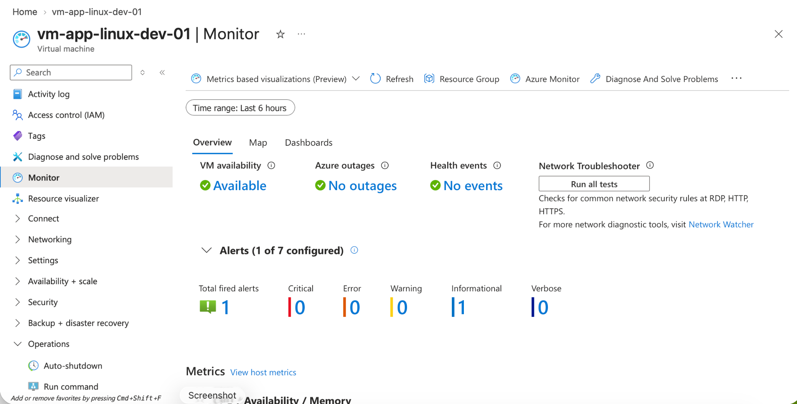

### CPU Metrics

Azure Monitor platform metrics were used to validate CPU utilization for the Linux workload.

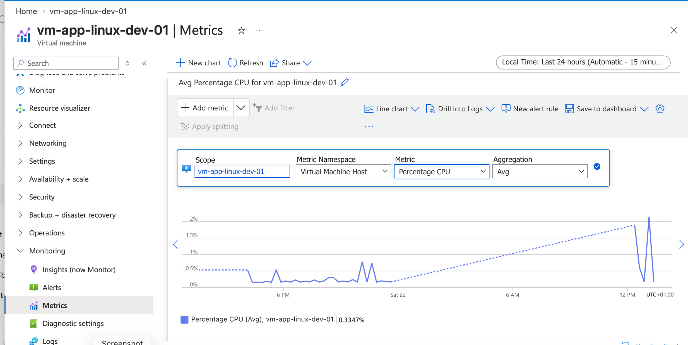

### Guest-Level Monitoring

Guest monitoring provided additional visibility into memory utilization and operating-system processes running inside the Linux VM.

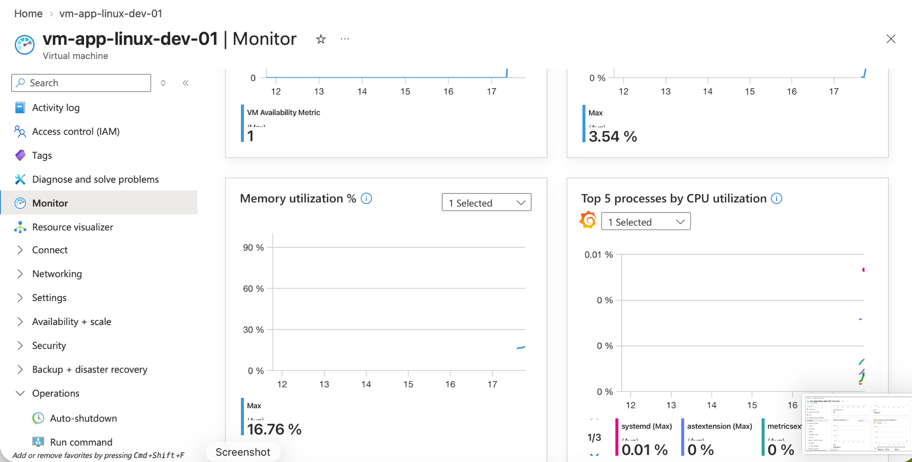

This monitoring configuration demonstrates the operational visibility required to support and troubleshoot cloud-hosted workloads in an enterprise Azure environment.


---

## Azure VM Backup and Recovery

Backup and recovery were configured for `vm-app-linux-dev-01` to provide workload protection and recovery capability for the Linux virtual machine.

Azure Backup was implemented using a Recovery Services vault and an enhanced backup policy. The configuration provides scheduled protection of the VM and maintains recovery points that can be used to restore the workload following data loss, corruption or operational failure.

### Backup Configuration

The backup implementation demonstrated:

- Azure VM backup protection
- Recovery Services vault integration
- Enhanced backup policy configuration
- Scheduled VM backup
- Successful backup pre-check validation
- Protection of all VM disks
- Successful backup job execution
- Creation of a recoverable restore point
- File-system consistent recovery point
- Operational verification of backup status

### Successful Backup Status

The VM backup configuration was successfully enabled and Azure reported the most recent backup operation as successful.

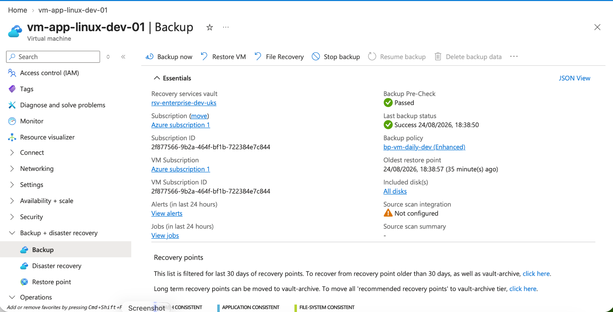

### Recovery Point Validation

A file-system consistent recovery point was successfully created for the Linux VM, demonstrating that the protected workload can be recovered from the Azure Backup service.

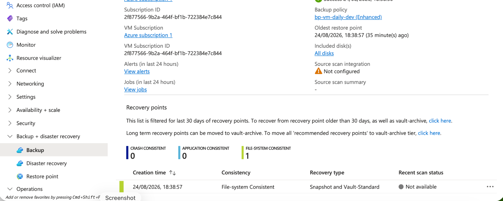

### Backup Job Validation

Azure Backup job history confirmed successful completion of both the backup configuration and VM backup operations.

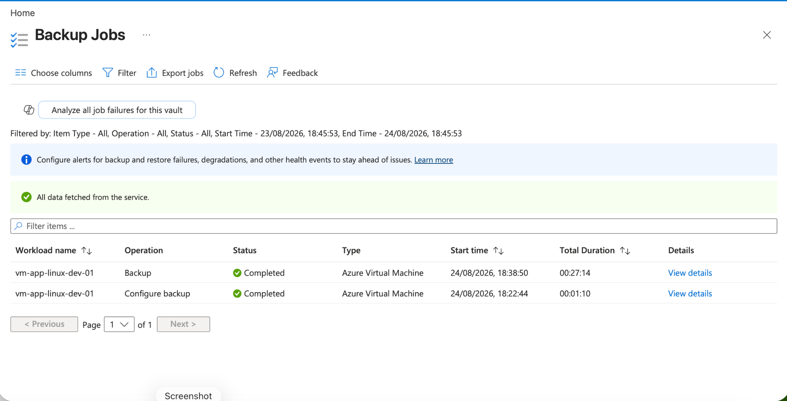

This backup implementation demonstrates a fundamental enterprise workload protection pattern by combining scheduled backup, centralized recovery services and validated recovery points for an Azure virtual machine.


---

## Azure VM Security, Identity and Least-Privilege Access

Security controls were implemented and validated for `vm-app-linux-dev-01` using Azure platform security, Microsoft Entra ID managed identities and Azure role-based access control (RBAC).

The implementation follows a defense-in-depth and least-privilege approach, combining workload security, identity-based authentication, network controls and scoped authorization.

### Security Controls

The security implementation demonstrated:

- Trusted Launch virtual machine security
- Secure Boot and virtual TPM (vTPM)
- Microsoft Defender for Cloud security assessment
- System-assigned managed identity
- Microsoft Entra ID workload identity
- Azure role-based access control (RBAC)
- Least-privilege access to Azure Storage
- Network Security Group inbound traffic control
- Network hardening validation

### Trusted Launch Security

The Linux VM was deployed using Azure Trusted Launch with Secure Boot and vTPM enabled, providing additional protection for the virtual machine boot process and platform integrity.

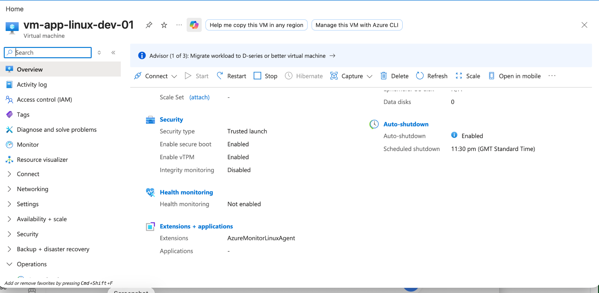

### Microsoft Defender for Cloud

Microsoft Defender for Cloud was used to review the security posture of the Azure workload and provide security recommendations and assessment visibility.

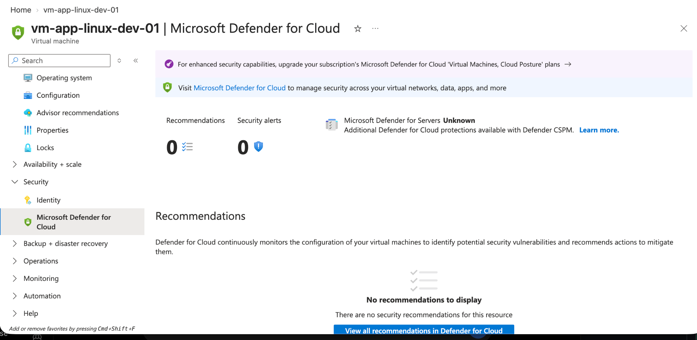

### System-Assigned Managed Identity

A system-assigned managed identity was enabled for the Linux VM, allowing the workload to authenticate to supported Azure services through Microsoft Entra ID without storing credentials directly within the virtual machine.

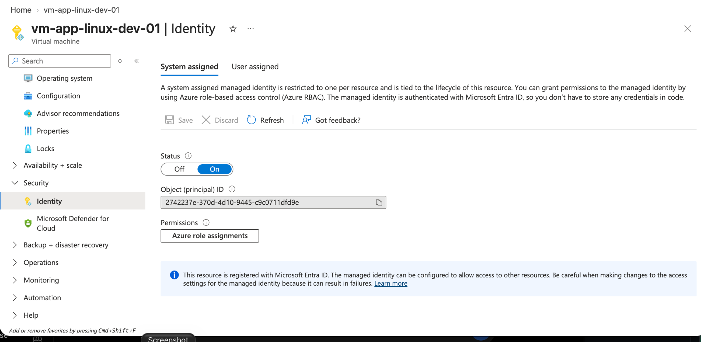

### RBAC and Least-Privilege Access

Azure RBAC was used to provide scoped access to Azure Storage. The implementation validated assignment of the Storage Blob Data Reader role rather than granting broader administrative permissions.

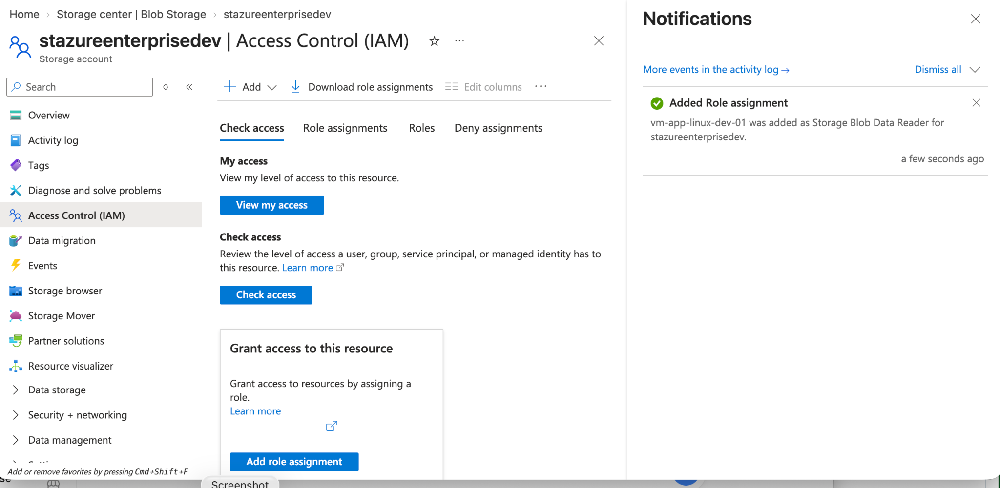

Least-privilege access was subsequently validated to confirm that the identity operated with the intended scoped permissions.

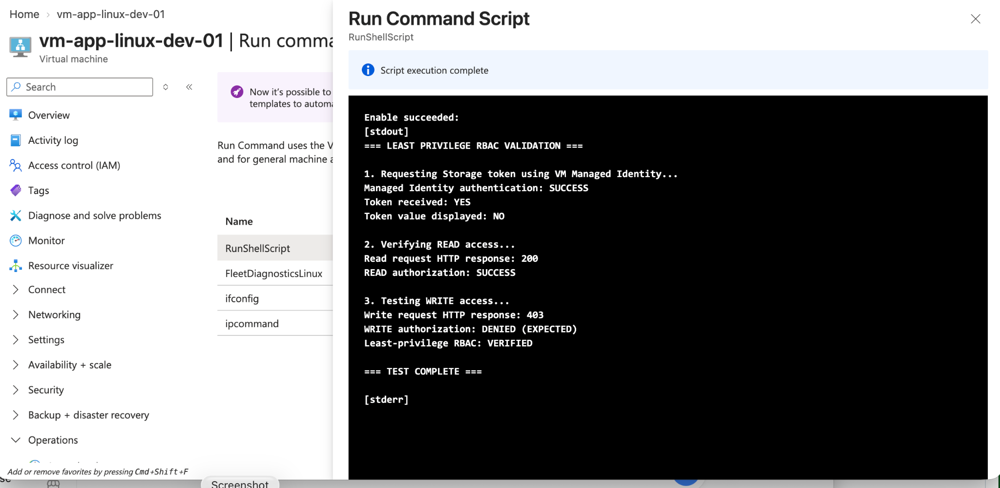

### Network Security Validation

Network Security Group controls were used to restrict inbound connectivity to the workload and reduce unnecessary network exposure.

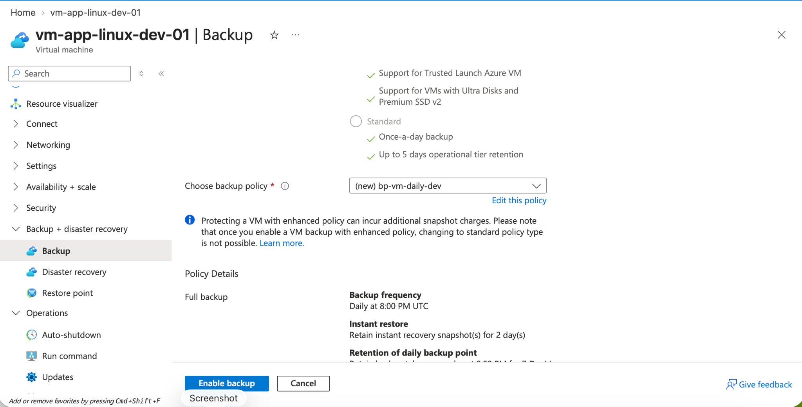

Additional network-hardening validation confirmed that the workload remained protected while retaining the connectivity required for normal operation.

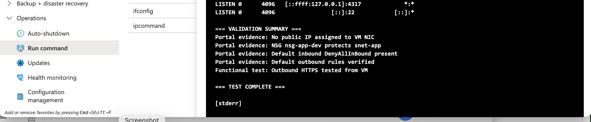

This security implementation demonstrates an enterprise Azure security pattern combining Trusted Launch, managed identities, RBAC, least-privilege authorization, Defender for Cloud and network-level protection.
