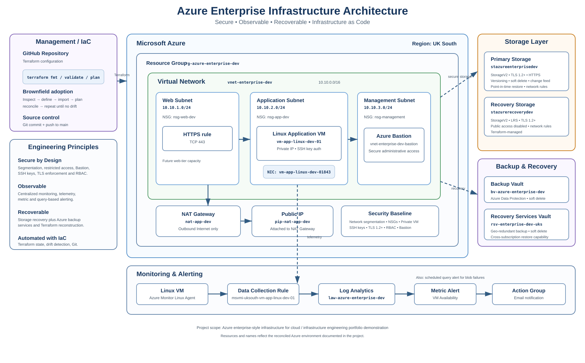

# Azure Enterprise Infrastructure — Architecture Documentation

## 1. Architecture Overview

This project implements a production-style Azure enterprise infrastructure environment designed to demonstrate practical cloud infrastructure engineering across networking, compute, security, storage, monitoring, backup and recovery, cost management, and Infrastructure as Code.

The environment was initially deployed and validated in Microsoft Azure and subsequently adopted into Terraform using a brownfield Infrastructure as Code workflow. Existing resources were inspected, represented as Terraform configuration, imported into Terraform state, and reconciled until the deployed Azure environment and Terraform configuration matched with no infrastructure drift.

### Core Architecture

The solution consists of:

- A dedicated Azure resource group for centralized lifecycle management.
- A segmented Azure Virtual Network with web, application, and management subnets.
- Network Security Groups providing subnet-level traffic controls.
- NAT Gateway-based outbound connectivity for application workloads.
- A private Linux application virtual machine without direct public exposure.
- Azure Bastion for secure administrative access.
- Azure Storage with network restrictions, TLS enforcement, versioning, retention, and recovery controls.
- Azure Monitor and Log Analytics for infrastructure observability.
- Azure Monitor Linux Agent and Data Collection Rules for VM telemetry.
- Metric and log-based alerting with Action Groups for notification.
- Azure Backup and Recovery Services components for data protection.
- Automatic VM shutdown controls for development cost optimization.
- Terraform for Infrastructure as Code, state adoption, dependency management, and drift reconciliation.

## Architecture Diagram

The following diagram provides a visual representation of the Azure enterprise infrastructure, including the segmented network topology, private compute architecture, secure administrative access, storage, monitoring, alerting, backup and recovery, and Terraform management model.



For the detailed technical architecture, continue with the design principles and component-level documentation below.

## 2. Design Principles

The architecture was developed around the following engineering principles:

### Security by Design

Infrastructure components are designed to minimize unnecessary public exposure. Network segmentation, Network Security Groups, restricted storage access, secure administrative connectivity, and least-privilege concepts form part of the overall security model.

### Network Segmentation

The Virtual Network separates web, application, and management workloads into dedicated subnets, allowing security controls and future workloads to be applied independently.

### Observability

Azure Monitor, Log Analytics, VM telemetry, metric alerts, scheduled query alerts, and Action Groups provide visibility into infrastructure health and operational events.

### Resilience and Recovery

Storage recovery controls, Azure Data Protection, Recovery Services, retention settings, and backup architecture demonstrate recovery planning as part of the infrastructure lifecycle.

### Cost Awareness

The environment uses development-oriented resource sizing, NAT-based connectivity, automatic VM shutdown, and Azure cost controls to demonstrate cloud cost governance alongside technical architecture.

### Infrastructure as Code

Terraform represents the deployed infrastructure as code. Existing Azure resources were adopted rather than unnecessarily recreated, demonstrating Terraform imports, state management, configuration reconciliation, dependency management, and drift detection.


## 3. Network Architecture

The network architecture uses a segmented Azure Virtual Network to separate workload tiers and provide a foundation for controlled communication between infrastructure components.

### Virtual Network

| Component | Configuration |
|---|---|
| Virtual Network | `vnet-enterprise-dev` |
| Address Space | `10.10.0.0/16` |
| Region | UK South |
| Environment | Development |

### Subnet Design

| Subnet | Address Range | Purpose |
|---|---|---|
| `snet-web` | `10.10.1.0/24` | Web-tier workloads |
| `snet-app` | `10.10.2.0/24` | Application-tier workloads |
| `snet-management` | `10.10.3.0/24` | Management and administrative workloads |

This segmentation allows security policies, routing, and future workloads to be managed independently rather than placing all resources into a single network segment.

### Network Security

Network Security Groups are associated with the web, application, and management network segments to provide traffic filtering and workload isolation.

The web-tier NSG includes an HTTPS rule for TCP port 443. Security controls are designed to limit unnecessary inbound exposure while maintaining the connectivity required by the environment.

The Linux application virtual machine does not depend on a directly assigned public IP address for administration.

### Outbound Connectivity

The application subnet uses an Azure NAT Gateway for controlled outbound Internet connectivity.

The NAT architecture consists of:

- Azure NAT Gateway
- Dedicated Public IP
- NAT Gateway association with the application subnet

This design separates outbound connectivity from direct inbound exposure of the application virtual machine.

### Secure Administrative Access

Azure Bastion provides secure administrative access to resources inside the Virtual Network without requiring a public IP address directly on the Linux virtual machine.

The environment uses the Azure Bastion Developer SKU integrated with `vnet-enterprise-dev`.

## 4. Compute Architecture

The compute layer contains a Linux virtual machine representing an application-tier workload.

### Linux Application VM

The virtual machine is deployed into `snet-app` and connected through a dedicated Azure Network Interface.

Key design characteristics include:

- Linux-based application workload
- Deployment in the application subnet
- Private network connectivity
- SSH key-based authentication
- Password authentication disabled
- Azure Monitor Linux Agent installed
- Boot diagnostics enabled
- Automatic operating system patch assessment
- Automatic VM shutdown for development cost optimization

### Administrative Authentication

SSH public-key authentication is used instead of password-based authentication.

The SSH public key is represented as a Terraform-managed Azure resource and referenced by the Linux virtual machine configuration.


### VM Monitoring Integration

The Azure Monitor Linux Agent connects the virtual machine to the monitoring architecture.

A Data Collection Rule defines telemetry collection and routes VM performance information into the Azure monitoring platform, supporting infrastructure health monitoring and alerting.


## 5. Storage and Data Protection Architecture

The environment uses Azure Storage to demonstrate secure cloud storage design, data lifecycle protection, network access controls, and recovery capabilities.

### Primary Storage Account

The primary StorageV2 account provides the main storage platform for the environment.

Security and resilience controls include:

- Minimum TLS version 1.2
- HTTPS-only traffic
- Public blob access disabled
- Network access restrictions
- Azure Services network bypass
- Application subnet integration
- Blob versioning
- Blob soft-delete retention
- Container soft-delete retention
- Blob change feed
- Point-in-time restore capability
- Microsoft-managed encryption

These controls demonstrate a layered approach to protecting stored data against unauthorized access, accidental deletion, and unintended modification.

### Recovery Storage Account

A separate StorageV2 recovery account provides an additional storage component for the recovery architecture.

The recovery storage account uses:

- Standard locally redundant storage
- Minimum TLS version 1.2
- Public blob access disabled
- Restricted network access
- Explicit IP-based access control
- Microsoft-managed encryption
- Terraform-managed configuration

Separating the recovery-oriented storage resource from the primary application storage provides clearer operational boundaries between application data and recovery-related infrastructure.

### Storage Network Security

Storage network rules use a default-deny approach, allowing only explicitly permitted network paths.

The primary storage account integrates with the application subnet, while controlled exceptions and Azure service access support required platform operations.

This configuration demonstrates the principle that storage services should not rely on unrestricted public network access when more specific access controls can be applied.

### Data Recovery Controls

The storage architecture includes multiple layers of data protection rather than relying on a single recovery mechanism.

These include:

- Blob versioning
- Soft-delete retention
- Container recovery
- Change tracking
- Point-in-time restore capability
- Azure Data Protection services
- Recovery Services infrastructure

Together, these controls provide protection against accidental deletion, data modification, and operational recovery scenarios.


## 6. Monitoring and Alerting Architecture

The environment uses Azure Monitor and Log Analytics to provide centralized observability for infrastructure health, performance telemetry, and operational events.

### Log Analytics Workspace

A dedicated Log Analytics Workspace acts as the central monitoring destination for the environment.

The workspace provides a foundation for:

- Centralized infrastructure telemetry
- Log collection and analysis
- Azure Monitor integration
- Query-based monitoring
- Operational troubleshooting
- Alert generation

### Linux VM Monitoring

The Linux application virtual machine is integrated with Azure Monitor through the Azure Monitor Linux Agent.

A Data Collection Rule defines the telemetry collection configuration for the virtual machine and connects VM monitoring data with the Azure monitoring platform.

The monitoring path can be represented as:

`Linux VM → Azure Monitor Linux Agent → Data Collection Rule → Azure Monitor / Log Analytics`

This provides centralized visibility into the health and performance of the application workload.

### VM Availability Monitoring

A dedicated Azure Monitor metric alert monitors the availability of the Linux virtual machine.

The alert evaluates the `VmAvailabilityMetric` from the `Microsoft.Compute/virtualMachines` metric namespace.

The configured alert uses:

- Metric: `VmAvailabilityMetric`
- Aggregation: Average
- Operator: LessThan
- Threshold: 1
- Evaluation frequency: 5 minutes
- Window size: 5 minutes
- Severity: 3

If the VM becomes unavailable or stops responding according to the configured availability metric, Azure Monitor can trigger the associated Action Group.

### Action Groups and Notifications

Azure Monitor Action Groups provide the notification layer for operational alerts.

The VM availability monitoring workflow is:

`Linux VM → Availability Metric → Metric Alert → Action Group → Email Notification`

This separates monitoring logic from notification delivery and allows additional notification channels to be incorporated in the future.

### Storage Failure Monitoring

The environment also includes a scheduled query alert for blob storage failures.

This provides log-based monitoring in addition to VM metric monitoring and demonstrates two complementary Azure Monitor alerting approaches:

1. Metric-based monitoring for infrastructure availability.
2. Query-based monitoring for operational and storage events.

The storage alert is integrated with an Azure Monitor Action Group to provide notification when the configured failure conditions are detected.

### Monitoring Design Outcome

The monitoring architecture provides multiple layers of observability across the environment:

- VM health monitoring
- Performance telemetry collection
- Centralized Log Analytics
- Metric-based alerting
- Query-based alerting
- Automated notification through Action Groups

This architecture demonstrates an operational monitoring model in which infrastructure is not only deployed but continuously observable and capable of generating actionable alerts.


## 7. Backup and Recovery Architecture

The environment implements multiple recovery mechanisms to demonstrate a layered approach to business continuity and data protection.

Rather than relying on a single backup mechanism, the architecture combines storage-level recovery capabilities with Azure backup and recovery services.

### Azure Data Protection Backup Vault

An Azure Data Protection Backup Vault is deployed in UK South as part of the recovery architecture.

The Backup Vault provides a platform for Azure-native data protection and represents the modern Azure Data Protection component of the environment.

Key characteristics include:

- Deployment within the project resource group
- UK South regional placement
- Locally redundant vault storage
- Soft-delete protection
- Terraform-managed configuration

The Backup Vault complements the recovery capabilities implemented directly on the storage accounts.

### Recovery Services Vault

A Recovery Services Vault is also deployed to represent traditional Azure workload protection and recovery capabilities.

The vault uses:

- Standard storage tier
- Geo-redundant backup storage
- Soft-delete protection
- Cross-subscription restore capability

The Recovery Services Vault demonstrates how Azure infrastructure can incorporate centralized backup and recovery services alongside workload-specific data protection controls.

### Layered Recovery Model

The overall recovery architecture provides several layers of protection:

1. Blob versioning protects against unintended object modification.
2. Soft delete protects against accidental deletion.
3. Container retention provides additional recovery capability.
4. Point-in-time restore supports recovery to an earlier storage state.
5. Azure Data Protection provides centralized backup capabilities.
6. Recovery Services provides infrastructure-level recovery services.
7. Terraform preserves the infrastructure configuration required to reconstruct the environment.

This layered model reduces dependency on any single recovery mechanism.

### Infrastructure Recovery with Terraform

Terraform provides an additional infrastructure recovery capability by storing the desired configuration of the Azure environment as code.

Although Terraform state is not itself a data-backup mechanism, the Terraform configuration allows infrastructure components and their relationships to be reconstructed consistently.

The Terraform configuration captures infrastructure such as:

- Virtual networking
- Subnets
- Network Security Groups
- NAT Gateway
- Compute
- Storage
- Bastion
- Monitoring
- Alerting
- Backup and recovery services

This provides a repeatable infrastructure definition alongside Azure-native data protection mechanisms.

### Recovery Validation

Recovery functionality was tested during the infrastructure testing phase of the project.

Testing included storage version recovery and soft-delete recovery to confirm that protected data could be restored after modification or deletion.

Detailed testing evidence is documented separately in:

[`infrastructure-testing.md`](infrastructure-testing.md)

The successful recovery tests demonstrate that the configured recovery controls are operational rather than purely architectural.


## 8. Security Architecture

Security controls are applied across the network, compute, storage, identity, and management layers of the environment.

The architecture follows a defense-in-depth approach in which multiple independent controls reduce unnecessary exposure and limit the impact of individual security failures.

### Network Security

The Virtual Network is segmented into dedicated web, application, and management subnets.

Network Security Groups provide subnet-level traffic filtering and allow security policies to be applied independently to different workload tiers.

Key network security characteristics include:

- Segmented subnet architecture
- Dedicated Network Security Groups
- Controlled HTTPS access
- Private application VM connectivity
- NAT Gateway for outbound connectivity
- No direct public IP dependency for the Linux application VM
- Azure Bastion for secure administrative access

### Compute Security

The Linux application virtual machine uses SSH public-key authentication rather than password-based authentication.

Password authentication is disabled, reducing exposure to password-based attacks.

The VM is deployed inside the application subnet and uses private network connectivity for workload communication and administration.

### Storage Security

Azure Storage is protected through multiple security controls, including:

- Minimum TLS version 1.2
- HTTPS-only communication
- Public blob access disabled
- Default-deny network rules
- Explicitly permitted network paths
- Microsoft-managed encryption
- Versioning and retention controls

These settings reduce unnecessary public exposure while protecting data in transit and at rest.

### Administrative Access

Azure Bastion provides administrative connectivity to resources inside the Virtual Network without requiring a public IP address directly on the Linux virtual machine.

This reduces the need to expose management protocols directly to the public Internet.

### Identity and Access Control

Azure Role-Based Access Control is used as part of the environment's identity and authorization model.

RBAC allows permissions to be assigned according to operational responsibilities rather than relying on unrestricted administrative access.

The project applies least-privilege principles when granting access to Azure resources and storage services.

### Security Design Outcome

The overall security model combines:

- Network segmentation
- Traffic filtering
- Private workload connectivity
- Secure administrative access
- SSH key authentication
- Restricted storage networking
- Encryption
- TLS enforcement
- Azure RBAC
- Monitoring and alerting
- Backup and recovery controls

Together, these controls demonstrate defense in depth across the infrastructure lifecycle.


## 9. Terraform Infrastructure as Code Architecture

Terraform provides the Infrastructure as Code layer for the Azure environment.

The project demonstrates not only Terraform-based resource definitions but also the adoption of an existing Azure environment into Terraform management.

### Terraform Repository Structure

Terraform configuration is separated by infrastructure responsibility to improve readability and maintainability.

The repository includes configuration for:

- Providers and Terraform settings
- Resource group
- Virtual networking
- Subnets
- Network Security Groups
- NAT Gateway
- NAT associations
- Linux compute
- Storage
- Monitoring and alerting
- VM monitoring
- Backup and recovery
- Azure Bastion
- Variables

This structure separates major infrastructure concerns while allowing Terraform to resolve dependencies between resources.

### Brownfield Infrastructure Adoption

The Azure environment existed before all resources were represented in Terraform.

A controlled brownfield adoption process was therefore used:

1. Inspect the existing Azure resource.
2. Identify its deployed configuration.
3. Create the equivalent Terraform resource definition.
4. Run `terraform fmt`.
5. Run `terraform validate`.
6. Import the existing Azure resource into Terraform state.
7. Run `terraform plan`.
8. Compare Terraform configuration with the deployed Azure resource.
9. Reconcile configuration differences without unnecessarily modifying Azure.
10. Repeat until Terraform reports no infrastructure differences.

This approach allowed the environment to be brought under Infrastructure as Code management without destroying and recreating existing resources.

### Drift Detection and Reconciliation

After resources were imported, Terraform plans were used to identify differences between:

`Terraform Configuration → Terraform State → Deployed Azure Infrastructure`

Configuration differences were investigated individually and reconciled until Terraform reported:

```text
No changes. Your infrastructure matches the configuration.

```


### Terraform State

Terraform state tracks the relationship between Terraform resource definitions and deployed Azure resources.

State files are treated as operationally sensitive artifacts and are excluded from the public Git repository.

The repository contains Terraform configuration but should not expose local Terraform state or backup state files.

### Infrastructure Dependencies

Terraform references are used to represent dependencies between Azure resources.

Examples include:

- Subnets referencing the Virtual Network
- NSG associations referencing subnets and Network Security Groups
- The VM Network Interface referencing the application subnet
- The Linux VM referencing its Network Interface and SSH configuration
- NAT Gateway associations referencing the application subnet
- Monitoring resources referencing the Linux VM
- Alerts referencing Action Groups
- Bastion referencing the Virtual Network

This allows Terraform to understand infrastructure relationships rather than relying solely on deployment order.

### Infrastructure as Code Outcome

At the completion of the Terraform adoption phase:

- Existing Azure resources were represented as Terraform configuration.
- Required Azure resources were imported into Terraform state.
- Configuration drift was investigated and reconciled.
- `terraform validate` completed successfully.
- `terraform plan` reported no infrastructure differences.
- Terraform changes were version-controlled with Git.
- The repository was synchronized with GitHub.

This demonstrates practical experience with Terraform configuration, imports, state management, dependency handling, drift detection, brownfield adoption, and Git-based Infrastructure as Code workflows.
